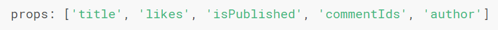
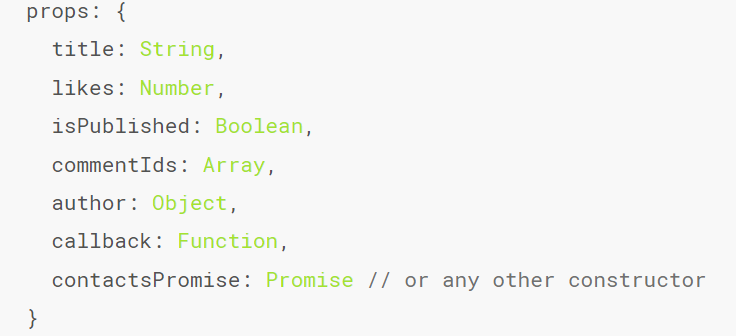

#### props 的大小写和短横线
+ 在 html 中大小写是不敏感的，需要使用短横线连接，在 js 中需要使用驼峰式的命名
+ 使用字符串模板的时候，不受上述的限制
#### props 的几种写法
+ 字符串数组的形式
+ 对象的形式给每个 prop 指定指定的值类型
+ 静态和动态绑定，静态绑定可以直接赋值，动态绑定时使用 v-bind: 绑定
#### props 的单向数据流
+ 所有的 prop 都使得其父子 prop 之间形成了一个单向下行绑定；父级 prop 的更新会向下流动到子组件中，但是反过来则不行。这样会防止从子组件意外变更父级组件的状态，从而导致你的应用的数据流向难以理解。
+ 额外的，每次父级组件发生变更时，子组件中所有的 prop 都将会刷新为最新的值。这意味着你不应该在一个子组件内部改变 prop。如果你这样做了，Vue 会在浏览器的控制台中发出警告。
+ 注意在 js 中对象和数组是通过引用传入的，所以对于一个数组或对象类型的 prop 来说，在子组件中改变这个对象或数组本身将会影响到父组件的状态。
